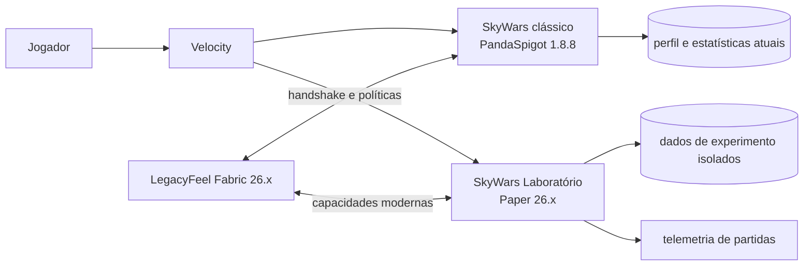

# Legacy+ e SkyWars Laboratório — plano de produto e arquitetura

Data: 16/09/2026

## Decisão

Há valor em oferecer o LegacyFeel para jogadores 26.x mesmo enquanto o SkyWars
principal continua em backend 1.8.8. Essa combinação permite preservar o
resultado competitivo clássico no servidor e melhorar a experiência no cliente
moderno. O produto deve ser apresentado como **Legacy+**: PvP com resposta e
leitura visual clássicas, acrescido de estabilidade, personalização e feedback
que o cliente 1.8.9 não oferece.

O backend principal da rede é 1.8.8/PandaSpigot; 1.8.9 é a versão histórica do
cliente. ViaVersion traduz o protocolo, mas não transforma o backend antigo em
um servidor moderno. Itens, entidades, componentes e mecânicas exclusivas da
26.x precisam de um backend 26.x separado.

Por isso, o produto terá duas pistas complementares:

1. **Legacy+ sobre o servidor clássico:** resultados de combate equivalentes
   entre clientes, com apresentação superior para quem usa 26.x + Fabric.
2. **SkyWars Laboratório 26.x:** fila e arenas isoladas para experimentar kits,
   habilidades, cosméticos e mecânicas que dependem da geração atual.

## Proposta de valor

### Por que alguém escolheria 26.x para jogar no servidor clássico

O cliente moderno precisa entregar benefícios perceptíveis sem criar vantagem
oculta ou tornar o resultado do golpe dependente do cliente:

- animações 1.7.10 contínuas em CPS alto, blockhit, consumo e vara;
- câmera de agachamento e fogo baixo mais legíveis;
- áudio e transformações visuais clássicas com execução estável;
- menus, tablist, acessibilidade e compatibilidade visual da versão atual;
- perfis de aparência configuráveis, com um preset competitivo recomendado;
- diagnóstico de conexão e de compatibilidade do servidor;
- cosméticos modernos que não alterem hitbox, alcance ou leitura do adversário;
- futuras informações de treino, replay e desempenho fora de partidas ranqueadas.

O ganho deve estar em consistência, clareza e conforto. Alcance, dano,
invulnerabilidade, knockback e validação do alvo continuam autoritativos no
servidor. Essa fronteira mantém a comparação justa com o cliente 1.8.9 e reduz
o risco de o mod ser percebido como cliente de vantagem.

### Limite da integração com backend 1.8.8

Em uma arena antiga, o cliente 26.x ainda recebe um mundo expresso pelo
protocolo 1.8. ViaVersion pode traduzir pacotes, materiais e entidades, mas não
consegue oferecer fielmente toda mecânica nova. Quanto mais uma habilidade
depender de um item ou estado que não existia na 1.8, maior será a quantidade
de simulação, substituições visuais e casos de inconsistência.

Assim, o backend antigo é adequado para **Legacy+** e comparação competitiva.
O **Laboratório** deve ser nativo da 26.x.

## Arquitetura proposta

### Camadas compartilhadas

Não compartilhar classes Bukkit entre 1.8 e 26.x. Compartilhar contratos e
dados estáveis:

- identificador permanente do kit e da habilidade;
- nome, descrição, raridade e ícone conceitual;
- regras de cooldown, cargas, duração e condição de ativação;
- eventos de domínio: início, dano, abate, interação, queda e fim da partida;
- resultado da habilidade, descrito sem tipos `Material`, `Entity` ou
  `ItemStack` de uma versão específica;
- esquema de telemetria e versão das regras da partida.

Cada runtime ganha adaptadores próprios:

- **adaptador clássico:** NuvenSkyWars atual, Java 8/API 1.8;
- **adaptador moderno:** plugin Paper 26.x, Java suportado pela versão alvo;
- **adaptador do cliente:** Fabric/LegacyFeel para renderização, sons, interface
  e recursos negociados no handshake.

### Negociação de capacidades

Evoluir o handshake atual para anunciar um perfil de servidor, por exemplo:

- `CLASSIC_PARITY`: backend antigo; somente apresentação Legacy+;
- `MODERN_LEGACY_COMBAT`: backend moderno com resultado de combate clássico;
- `SKYWARS_LAB`: recursos experimentais e interface moderna habilitados;
- `VANILLA_SAFE`: servidor sem integração; apenas opções locais seguras.

O servidor envia as capacidades permitidas e a versão das regras. O cliente
ativa somente o que foi anunciado. A ausência do mod não pode impedir conexão,
mas uma experiência que dependa de interface exclusiva deve ter alternativa
servidor-side ou explicar claramente o requisito antes de entrar na fila.

## SkyWars Laboratório

O desenho detalhado da primeira experiência jogável — pacote obrigatório,
Mirage, Domínio, Reverso, jaulas e cosméticos de projétil — está em
[SkyWars Laboratório — primeira experiência jogável](SKYWARS-LAB-VERTICAL-SLICE.md).

### Regras do modo

- backend e fila próprios, fora do pool competitivo clássico;
- todos os kits e níveis liberados durante o experimento;
- cosméticos liberados apenas dentro do Laboratório;
- sem cobrança, consumo de moedas ou alteração de propriedade no perfil;
- sem ELO, winstreak, missões ou estatísticas oficiais no primeiro piloto;
- partidas identificadas com `rulesetId` e versão imutável;
- inventário, entidades, tarefas e efeitos limpos ao encerrar cada partida;
- opção de enviar avaliação curta depois da partida;
- recurso individual pode ser desligado por configuração sem novo build.

### O que reaproveitar do SkyWars atual

O repositório atual já possui pontos que podem orientar o novo núcleo:

- `Kit`, `KitLevel` e YAML dos kits como catálogo de conteúdo;
- `KitAbility` e `KitAbilityManager` como ideia de despacho por evento;
- eventos `SWGameStartEvent`, `SWPlayerDamageEvent`, `SWPlayerDeathEvent` e
  `SWPlayerInteractEvent` como vocabulário inicial;
- seleção, layout de inventário e kit aleatório como requisitos do usuário;
- ciclo de arena, cache de partidas, mapas Slime e integração com Velocity como
  comportamento a reproduzir por adaptadores;
- cosméticos de abate, projétil, jaula e vitória como catálogo para a migração.

Não portar diretamente referências a `Material`, NMS, ProtocolLib, inventários
1.8 ou serialização antiga. O código atual contém lógica de produto valiosa,
mas suas APIs e formatos de item pertencem ao runtime antigo.

### Kit moderno como definição versionada

Cada kit moderno deve declarar:

- identidade e versão;
- itens iniciais por chave semântica;
- atributos e componentes explícitos;
- habilidade ativa/passiva;
- cooldown, cargas e feedback;
- restrições por fase da partida;
- limpeza obrigatória;
- métricas de balanceamento;
- fallback visual para cliente moderno sem mod, quando possível.

Isso permite transformar kits atuais sem perder sua identidade. Um kit pode ter
uma implementação clássica e outra moderna com o mesmo tema, mas regras e
balanceamento versionados separadamente.

### Primeiros experimentos recomendados

1. **Movimento e resgate:** habilidades de impulso, queda e retorno que usem a
   física moderna sem remover o risco de cair da ilha.
2. **Projéteis com identidade:** variações modernas de vara, arco e projéteis,
   mantendo telemetria de acerto e knockback.
3. **Controle de espaço:** áreas temporárias claramente visíveis, inspiradas nas
   habilidades Domain já existentes.
4. **Ilusão e informação:** evolução do Mirage com entidades modernas e sinais
   visuais consistentes para atacante e alvo.
5. **Cosméticos reativos:** efeitos de eliminação e vitória com display entities,
   partículas e sons modernos, sem interferência em hitbox ou visibilidade.

O primeiro piloto deve usar poucos kits representativos. Liberar todo o catálogo
na interface não exige portar todas as habilidades antes de medir se o ciclo de
partida moderno funciona.

## Fases de entrega

### Fase 0 — contrato e linha de base

- congelar medições de combate 1.7.10, 1.8.9 e LegacyFeel;
- registrar alcance, cadência aceita, dano, i-frames, knockback, sprint reset,
  vara, bloqueio e consumo;
- definir quais diferenças são correções, preferências visuais ou experiências;
- versionar `rulesetId`, capacidades e eventos de telemetria;
- manter toda execução fora dos servidores ativos.

**Saída:** matriz comparativa reproduzível e contrato Legacy+ v2.

### Fase 1 — Legacy+ convincente no backend clássico

- concluir fidelidade visual e sonora do combate;
- medir cliente 1.8.9 versus 26.x no mesmo alvo e condições de rede;
- exibir estado de compatibilidade e perfil ativo de forma simples;
- adicionar telemetria de discrepâncias sem alterar dano no cliente;
- criar teste fechado com jogadores habituados a 1.8.9.

**Critério:** os resultados do servidor permanecem equivalentes, e os
testadores preferem a leitura/fluidez da 26.x sem relatar ações fantasmas.

### Fase 2 — esqueleto do Laboratório 26.x

- criar plugin moderno separado, sem dependência binária do NuvenSkyWars 1.8;
- implementar uma arena descartável, estados de partida e limpeza;
- adicionar fila `skywars-lab` no roteamento de homologação;
- criar catálogo somente leitura de kits e modo de desbloqueio total;
- isolar banco, estatísticas e recompensas;
- suportar conexão com e sem LegacyFeel, registrando capacidades.

**Critério:** partidas repetidas não deixam tarefas, entidades, inventários ou
dados persistentes; falha do Laboratório não afeta o SkyWars clássico.

### Fase 3 — fatia jogável

- portar três kits: um simples, um de mobilidade e um de habilidade complexa;
- implementar baús, borda/eventos e condição de vitória;
- ativar cosméticos modernos selecionados;
- coletar escolha, uso, dano, abates, quedas, duração e abandono;
- disponibilizar todos os três kits sem economia.

**Critério:** ciclo completo com dois ou mais jogadores e relatório por
`matchId`/`rulesetId`.

### Fase 4 — balanceamento e criação contínua

- editor/configuração validada para kits e modificadores;
- rotação de experiências por feature flag;
- comparação A/B apenas de apresentação ou regras claramente anunciadas;
- replay e ferramentas para investigar mortes e habilidades;
- processo de promoção: experimento, revisão, temporada e eventual modo fixo.

## Métricas para decidir se a estratégia funciona

### Adoção do cliente moderno

- proporção de entradas 26.x com e sem LegacyFeel;
- retorno em 7 e 30 dias por tipo de cliente;
- taxa de saída após primeira partida;
- preferência declarada entre 1.8.9 e Legacy+;
- divergências de ataque enviado, ataque aceito e dano aplicado;
- reclamações de animação, rod, blockhit, knockback e ações fantasmas.

### Qualidade do Laboratório

- partidas iniciadas e concluídas;
- tempo de fila e duração;
- escolha, uso e eficácia por kit;
- mortes por vazio, combate e habilidade;
- vantagem por spawn/mapa;
- falhas de limpeza e erros por partida;
- avaliação de diversão, clareza e desejo de jogar novamente.

Não usar apenas vitória por kit como medida de força. Separar seleção, nível dos
jogadores, mapa, duração e taxa de uso da habilidade.

## Riscos e controles

| Risco | Controle |
|---|---|
| Cliente moderno parece dar vantagem injusta | Servidor autoritativo, capacidades explícitas e testes de paridade |
| Tradução ViaVersion gera ações fantasmas | Matriz por protocolo e telemetria pacote → evento → dano |
| Plugin 1.8 vira uma migração interminável | Extrair contratos; reimplementar somente a fatia necessária na 26.x |
| Experimento altera economia ou ranking | namespace e armazenamento isolados, sem recompensas oficiais |
| Habilidade deixa entidades/tarefas | escopo por partida e limpeza testada no encerramento |
| Cosmético atrapalha combate | orçamento visual, opção de reduzir efeitos e proibição de mudança de hitbox |
| Laboratório compromete produção | backend fora do pool, limite de recursos e implantação pelo Pterodactyl |
| Conteúdo cresce sem evidência | três kits no primeiro piloto e promoção guiada por métricas |

## Próximo incremento recomendado

O próximo trabalho de implementação deve ser o **contrato Legacy+ v2**, ainda no
repositório isolado:

1. adicionar `serverProfile`, `rulesetId` e `capabilities` ao handshake;
2. manter compatibilidade com o protocolo v1 atual;
3. criar uma tela/indicador discreto que confirme “Legacy+ ativo”;
4. registrar versão do cliente, backend e regras na telemetria;
5. preparar um simulador de políticas para testar Classic, Modern e Lab sem
   tocar nos servidores do NuvenClub.

Depois disso, criar o esqueleto do Laboratório como projeto separado. Nenhuma
mudança deve ser distribuída ao proxy, à Arena SkyWars ou ao banco de produção
durante essas duas etapas.
