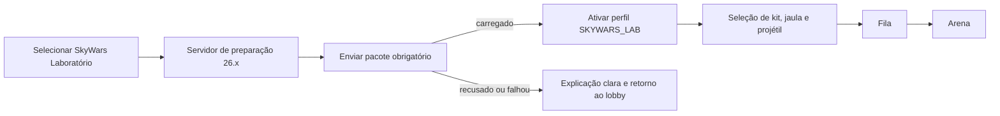
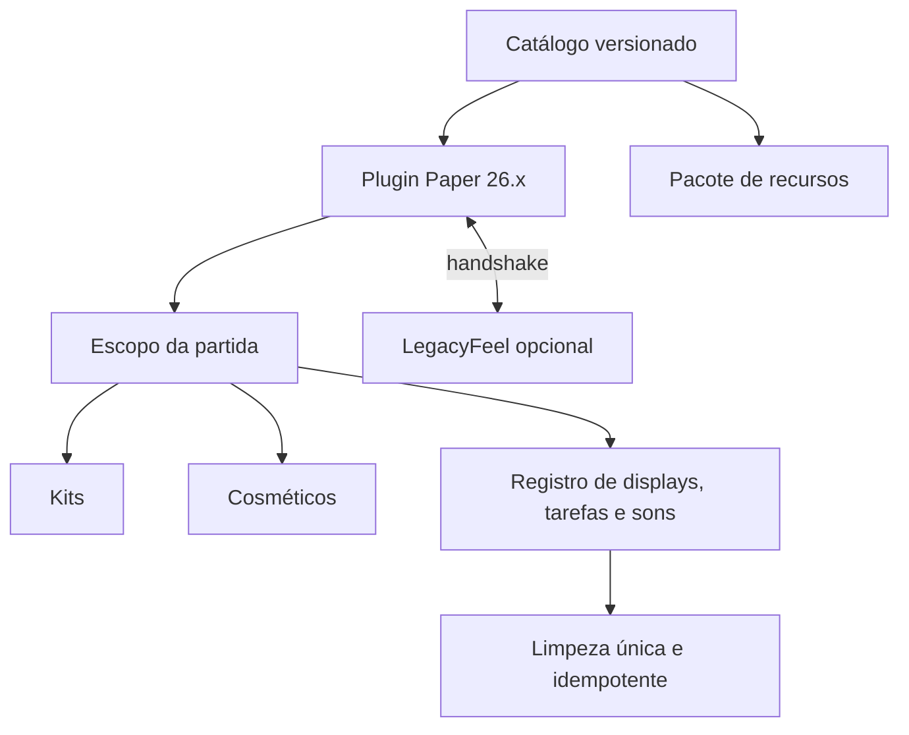

# SkyWars Laboratório — plano da primeira experiência jogável

Data: 16/09/2026

## Estado da implementação

A primeira fatia técnica já está executável em `testserver/skywars-lab`, na
porta `25576`. Ela inclui bloqueio obrigatório pelo estado do pacote, seleção e
entrega dos três kits, Domínio com núcleo 3D e hitbox separada, Reverso com
validação dos dois destinos, Mirage com manequim e invisibilidade, quatro
prévias de jaula, quatro efeitos de projétil e limpeza centralizada.

O servidor carrega `LegacyFeel-Server`, `OldCombatMechanics` e `PacketEvents`
como camada de combate e telemetria. O pacote atual usa modelos geométricos e
sons vanilla remapeados para validar todo o fluxo. A arte final do Blockbench,
os arquivos OGG próprios, uma arena com ciclo completo de partida e os testes
de balanceamento continuam como etapas seguintes. Assim, o protótipo atual
serve para testar habilidades, leitura visual e integração; ele ainda não é o
modo SkyWars pronto para publicação.

## Objetivo

Criar uma fila separada de SkyWars nativa da 26.x que demonstre, já na
primeira partida, por que vale a pena jogar na versão moderna. A primeira
experiência será construída ao redor de três kits — **Mirage**, **Domínio** e
**Reverso** —, um pacote de recursos obrigatório, jaulas modernas e escolha de
cosmético de projétil.

Este recorte não tenta portar todo o SkyWars. Ele deve comprovar quatro pontos:

1. modelos 3D e áudio próprio podem dar identidade às habilidades sem esconder
   informações de combate;
2. habilidades modernas podem continuar previsíveis e competitivas;
3. uma partida pode criar e remover displays, partículas, sons e tarefas sem
   deixar resíduos;
4. o jogador percebe valor na 26.x antes de expandirmos o catálogo.

## Escopo fechado do piloto

### Incluído

- backend Paper 26.x separado do SkyWars 1.8.8;
- uma arena descartável e um fluxo completo de partida;
- pacote de recursos obrigatório e versionado;
- kits Mirage, Domínio e Reverso liberados para todos;
- uma jaula padrão e três jaulas cosméticas modernas;
- escolha entre quatro cosméticos de projétil;
- interface de seleção, prévia e descrição dos três kits;
- telemetria de uso, clareza, desempenho e limpeza;
- opção individual de efeitos reduzidos.

### Fora do piloto

- demais kits;
- economia, moedas, caixas, raridades e venda de cosméticos;
- ELO, winstreak, missões, passe e estatísticas oficiais;
- migração completa das arenas antigas;
- cosméticos de vitória, morte, queda e mensagens;
- editor público de modelos ou habilidades.

Esses itens só entram no plano depois que o piloto provar que o ciclo de
partida, os três kits e o pacote de recursos funcionam bem.

## Jornada de entrada e pacote obrigatório

O Laboratório aceitará apenas clientes da versão moderna definida pelo
`rulesetId`. O LegacyFeel será recomendado para a experiência completa de PvP,
mas o pacote visual usará recursos vanilla e não dependerá do mod para ser
renderizado.



### Regras do carregamento

- enviar o pacote antes de colocar o jogador na fila;
- exigir aceite apenas ao entrar no Laboratório, sem afetar os modos clássicos;
- usar URL HTTPS imutável, UUID de versão e hash SHA-1;
- liberar menus e fila somente depois de `SUCCESSFULLY_LOADED`;
- em recusa ou falha, tentar retornar ao lobby; se a conexão já tiver sido
  encerrada pelo cliente, mostrar uma mensagem curta com a causa;
- reutilizar o cache quando UUID e hash forem iguais;
- publicar uma nova identidade para cada mudança do pacote;
- registrar aceite, falha, duração do download e versão carregada;
- impedir que uma partida misture jogadores com versões diferentes do pacote.

O servidor também anunciará pelo handshake:

- `serverProfile: SKYWARS_LAB`;
- `rulesetId: skywars-lab-pilot-v1`;
- `resourcePackId` e versão do catálogo visual;
- capacidades `labKitsV1`, `labDisplaysV1`, `labAudioV1` e
  `labCosmeticsV1`.

## Direção visual e sonora

Cada habilidade terá quatro momentos legíveis: **pronta**, **preparação**,
**efeito ativo** e **fim/cooldown**. Cor nunca será o único sinal; forma,
movimento e áudio também indicarão o estado.

| Família | Forma | Paleta inicial | Som | Leitura desejada |
|---|---|---|---|---|
| Mirage | prismas, reflexos e fragmentos | ciano e violeta | vidro suave, eco curto | dúvida controlada, sem esconder perigo real |
| Domínio | arcos, selo e núcleo vertical | roxo escuro, magenta e dourado | pulso grave e cristal | área poderosa com centro e limite evidentes |
| Reverso | dois anéis opostos e fita espacial | azul elétrico e rosa | subida dupla e estalo estéreo | origem, alvo e momento da troca claros |

### Orçamento visual

- usar um modelo composto em um `ItemDisplay` sempre que possível;
- reservar múltiplos displays apenas para partes que realmente precisam se
  mover separadamente;
- animar transformações por interpolação do cliente, evitando atualização a
  cada tick;
- limitar efeitos persistentes por distância e por observador;
- concentrar partículas em ativação, impacto e encerramento;
- manter o centro da tela e a silhueta dos jogadores livres;
- oferecer `/lab efeitos reduzidos`, preservando todos os sinais competitivos;
- remover todos os displays, hitboxes e tarefas ao terminar a habilidade, a
  partida, o mundo ou a conexão do jogador.

### Áudio

- sons próprios em OGG, curtos e posicionais;
- um sinal local para quem ativa e outro audível para adversários próximos;
- nenhuma trilha contínua durante combate;
- volume e distância configuráveis por evento;
- variação pequena de afinação para repetição sem ruído cansativo;
- silêncio completo depois que a habilidade for limpa;
- somente arquivos produzidos para o projeto ou com licença registrada.

## Pipeline do pacote de recursos

### Organização

```text
pack/
  assets/nuven/
    items/                 definições de itens da versão alvo
    models/                modelos exportados e partes reutilizáveis
    textures/              texturas dos kits, jaulas e projéteis
    particles/             sprites de partículas próprias
    sounds/                efeitos em OGG
    sounds.json
    lang/pt_br.json
  manifest/visual-catalog.json
  pack.mcmeta
```

### Fluxo de arte

1. criar o modelo no Blockbench em escala real de Minecraft;
2. separar pivôs somente quando uma parte precisar de animação própria;
3. exportar para o formato de modelo da versão 26.x;
4. registrar um identificador estável, por exemplo
   `nuven:kit/dominio/core_intact`;
5. validar texturas ausentes, nomes, JSON, tamanho e referências;
6. gerar ZIP reproduzível, UUID, SHA-1 e catálogo;
7. testar inventário, primeira pessoa, terceira pessoa e `ItemDisplay`;
8. publicar o artefato imutável no ambiente de homologação.

O formato do pacote será obtido da versão alvo durante o build. Não manteremos
um número copiado manualmente entre atualizações do Minecraft.

### Contrato de um recurso

Cada entrada do catálogo declara:

- identificador e versão;
- arquivo de modelo e texturas;
- contexto permitido: mão, GUI, display, projétil ou jaula;
- escala e ponto de origem;
- estados visuais, como íntegro, danificado e quebrado;
- sons de preparação, ativação, impacto e fim;
- custo visual estimado;
- fallback textual para diagnóstico.

## Kit 1 — Domínio

Domínio será a primeira implementação porque testa o conjunto mais amplo de
recursos modernos.

### Fantasia

O jogador finca o **Selo do Domínio** e invoca uma arena temporária. No centro
surge o **Núcleo do Domínio**, uma escultura 3D feita no Blockbench. O núcleo
substitui o Ender Crystal usado como totem na implementação 1.8.

### Funcionamento do piloto

- item ativo: Selo do Domínio com modelo próprio;
- ativação explícita no chão, evitando disparo acidental durante um ataque;
- raio inicial de 8 blocos e duração máxima de 25 segundos, preservando a
  referência atual;
- inimigos dentro da área recebem as regras configuradas do domínio;
- o dono recebe o benefício configurado pelo servidor;
- adversários podem destruir o núcleo para encerrar a área antes do tempo;
- vida inicial do núcleo: 40, ajustável pelo `rulesetId`;
- dano, bônus, cura e redução de vida continuam autoritativos no servidor.

### Modelo 3D: Núcleo do Domínio

Direção de arte: uma base de pedra negra com dois arcos suspensos ao redor de
um cristal central. Runas douradas indicam propriedade; o cristal pulsa em
magenta. O modelo terá três estados:

1. **íntegro:** arcos alinhados e núcleo brilhante;
2. **danificado:** rachaduras acesas e rotação irregular;
3. **crítico:** fragmentos separados, pulso rápido e brilho reduzido.

O `ItemDisplay` é apenas visual. Uma hitbox separada e invisível recebe os
ataques, e o servidor associa cada golpe ao núcleo. Isso permite arte detalhada
sem alterar alcance ou colisão.

### Efeitos e som

- preparação: selo desenhado no chão de dentro para fora;
- ativação: onda circular baixa, quatro arcos breves e pulso grave;
- área ativa: anel no chão, pilares espaçados e névoa abaixo da cintura;
- dano ao núcleo: rachadura luminosa direcionada para quem bateu;
- estado crítico: batimento mais rápido, audível apenas dentro da área;
- destruição: os arcos fecham sobre o cristal e se desfazem em fragmentos;
- fim por tempo: o pulso desacelera e o modelo afunda, distinguindo as causas.

A parede nunca será opaca. Jogadores de dentro e de fora precisam enxergar
pontes, bordas e adversários.

### Métricas específicas

- inimigos capturados;
- duração real;
- dano causado e recebido dentro da área;
- golpes e tempo para destruir o núcleo;
- término por destruição, tempo, morte ou limpeza;
- mortes próximas à borda da área;
- quantidade máxima de displays e partículas por observador.

## Kit 2 — Reverso

O nome público será **Reverso**. O identificador interno manterá o vínculo com
o kit antigo `inversao`/ID 28 para migração e telemetria.

### Fantasia

O jogador lança um **Marcador de Paradoxo**. Ao acertar outro jogador, cria uma
ligação temporária. A segunda ativação troca as posições dos dois.

### Funcionamento do piloto

- um projétil de marcação sem dano;
- marca válida por até 10 segundos;
- o dono perde a marca se receber dano, como na regra atual;
- segunda ativação troca posição e direção dos dois jogadores;
- cooldown inicial de 20 segundos após uma troca concluída;
- validar novamente os dois destinos imediatamente antes da troca;
- cancelar em mundo diferente, chunk indisponível, sufocamento, partida
  encerrada ou alvo inválido;
- uma posição no ar continua válida: trocar alguém sobre o vazio faz parte da
  identidade estratégica do kit;
- política de velocidade e distância de queda ficará atrás de uma configuração
  A/B até os testes definirem a opção mais compreensível.

O salto unilateral existente não entra no piloto. A troca de posições precisa
ser excelente antes de adicionarmos uma segunda função ao kit.

### Modelo, efeitos e som

- item 3D: dois anéis metálicos girando em sentidos opostos ao redor de um
  pequeno núcleo;
- projétil: silhueta reconhecível com duas fitas curtas, sem mudar hitbox;
- acerto: anel azul no dono e rosa no alvo;
- marca ativa: pulsos discretos nos pés e uma ligação que aparece em
  intervalos, sem desenhar uma linha permanente através do mapa;
- ativação: os anéis contraem por aproximadamente 0,35 s e as posições trocam;
- chegada: onda curta no chão orientada para a nova direção do jogador;
- áudio: nota ascendente na marca, duas notas convergentes na ativação e um
  estalo espacial na troca.

O alvo recebe indicação visual e sonora da marca. O kit cria surpresa pela
decisão e pelo posicionamento, não por esconder que a habilidade existe.

### Métricas específicas

- projéteis lançados, acertos e marcas expiradas;
- trocas concluídas e canceladas, com motivo;
- tempo entre marca e ativação;
- abates e quedas até cinco segundos depois da troca;
- casos de correção de posição, sufocamento ou entrada em bloco;
- resultado de cada política de velocidade testada.

## Kit 3 — Mirage

Mirage será implementado depois dos outros dois porque clones convincentes
exigem mais testes de rede, animação, equipamento e percepção.

### Fantasia

O **Prisma de Mirage** projeta cópias do jogador e permite uma única janela de
invisibilidade. O objetivo é induzir uma decisão errada, mantendo pistas que um
adversário atento consegue interpretar.

### Funcionamento do piloto

- três cargas de clone, preservando a identidade atual;
- clone parado ou enviado na direção em que o dono olha;
- aparência do dono no instante da criação: skin, armadura e item principal;
- movimento com gravidade, degrau simples e interrupção em obstáculos;
- clone pode olhar, balançar o braço e simular uma troca de item em momentos
  coerentes, sem causar dano ou colisão;
- um golpe recebido desfaz o clone imediatamente;
- vida máxima curta e limpeza garantida ao sair, morrer ou terminar a partida;
- invisibilidade com canalização parada e uma utilização por partida;
- duração de referência de 15 segundos;
- invisibilidade termina ao atacar, receber dano ou usar projétil;
- nome e indicadores do jogador real somem de forma consistente para todos os
  observadores durante o efeito.

### Modelo, efeitos e som

- item 3D: prisma dobrável com lente central;
- preparação: três reflexos do jogador convergem para a posição real;
- nascimento do clone: lâmina de luz vertical e fragmentos que formam a cópia;
- clone atingido: quebra de vidro curta, sem explosão que esconda o atacante;
- canalização: reflexo circular fecha sobre o jogador;
- invisibilidade: refração breve na saída e pequenos ecos apenas nos momentos
  definidos pelo balanceamento;
- revelação: contorno de fragmentos regressa ao corpo;
- sons diferentes para clone criado, clone destruído, invisibilidade pronta e
  revelação forçada.

O clone terá um sinal sutil e aprendível depois de alguns segundos, como uma
falha curta na projeção. De perto, um jogador atento deve conseguir distinguir
uma cópia; à distância, a dúvida deve permanecer.

### Métricas específicas

- clones criados, atingidos e ignorados;
- tempo até um adversário atacar o clone;
- distância do adversário quando foi enganado;
- canalizações concluídas e canceladas;
- duração real da invisibilidade e causa da revelação;
- dano ou queda obtidos até cinco segundos depois de uma distração.

## Jaulas

A jaula terá física e arte separadas. Barreiras transparentes ou colisões
servidor-side mantêm o jogador no lugar; os modelos 3D são somente apresentação.
Essa separação evita aprisionamento, blocos fantasmas e vantagem por hitbox.

### Catálogo inicial

1. **Prisma** — jaula padrão, leve, formada por placas transparentes e cantos
   metálicos; abertura por dissolução vertical.
2. **Criocápsula** — evolução da jaula Gelo; cristais crescem nas bordas e
   quebram para fora na abertura.
3. **Cápsula de Confete** — evolução da jaula Foguete; contagem mecânica,
   propulsores visuais e abertura com confetes, sem impulso no jogador.
4. **Santuário do Domínio** — quatro pequenos arcos e um selo no piso; abertura
   pelo recolhimento dos arcos.

### Experiência

- seleção disponível na sala de preparação;
- prévia em tamanho real, com botão para repetir a abertura;
- todas liberadas no Laboratório;
- escolha salva em namespace experimental, sem alterar propriedade no perfil
  clássico;
- sequência sincronizada com a contagem da partida;
- modelo some antes de liberar movimento e colisão;
- nenhuma jaula pode esconder ilhas vizinhas durante toda a contagem.

## Cosméticos de projétil

O piloto reaproveitará quatro identidades do catálogo atual:

| Opção | Tratamento moderno |
|---|---|
| Chamas | fita curta de brasas, impacto seco e faíscas no chão |
| Ninja | pequenos cortes de fumaça e impacto em forma de estrela |
| Místico | runas espaçadas que giram e se fecham no impacto |
| Nuven | pequenos volumes de nuvem com centelha azul no acerto |

### Regras competitivas

- o projétil vanilla continua sendo a fonte de posição, colisão e dano;
- o cosmético não altera velocidade, tamanho, alcance ou knockback;
- a silhueta principal continua reconhecível;
- o efeito para quando o projétil morre, descarrega ou muda de mundo;
- lançamento, voo e impacto têm limites separados de partículas e som;
- prévia mostra arco, flecha, bola de neve e vara quando aplicável;
- jogadores com efeitos reduzidos ainda veem um sinal curto de lançamento e
  impacto;
- a seleção é liberada para todos e isolada da economia durante o piloto.

## Arquitetura de execução



### Princípios

- servidor autoritativo para alvo, dano, teleporte, cooldown e vitória;
- conteúdo identificado por chaves estáveis, sem compartilhar classes Bukkit
  com o plugin 1.8;
- todo efeito pertence a um `matchId` e a um escopo descartável;
- cada criação registra imediatamente sua rotina de remoção;
- limpar duas vezes deve ser seguro;
- regras e números vêm de uma versão imutável de configuração;
- partículas e displays são enviados por proximidade e preferência;
- cada kit e cosmético tem uma feature flag independente;
- falha visual não pode decidir dano nem impedir o encerramento da partida.

## Ordem de desenvolvimento

### Etapa 0 — protótipo técnico e direção de arte

- criar projeto separado do plugin moderno e do pacote;
- validar um modelo Blockbench em mão, GUI e `ItemDisplay`;
- validar um som próprio posicional;
- construir o verificador do pacote e catálogo;
- definir as três paletas e as formas de leitura.

**Saída:** sala vazia com um modelo animado, som e remoção verificável.

### Etapa 1 — entrada, pacote e partida mínima

- implementar servidor de preparação e bloqueio até o pacote carregar;
- handshake `SKYWARS_LAB`;
- seleção dos três kits, jaulas e projéteis;
- uma arena, spawn, baús mínimos, início, morte, espectador e vitória;
- registro central de recursos da partida.

**Saída:** dois jogadores concluem partidas repetidas sem resíduos.

### Etapa 2 — Domínio como fatia vertical

- produzir Selo e Núcleo no Blockbench;
- implementar área, núcleo, hitbox, três estados visuais e áudio;
- adicionar telemetria e efeitos reduzidos;
- testar visibilidade de pontes e limites da arena.

**Saída:** primeira habilidade completa e apresentável.

### Etapa 3 — Reverso

- produzir Marcador de Paradoxo;
- implementar marca, aviso, validação e troca;
- testar colisão, vazio, borda, ping e políticas de velocidade;
- garantir ausência de entrada em blocos.

**Saída:** troca confiável em todos os pontos válidos da arena.

### Etapa 4 — Mirage

- produzir Prisma e efeitos de formação;
- implementar clones com aparência e animação;
- implementar canalização, invisibilidade e revelação;
- validar percepção por diferentes observadores e latências.

**Saída:** clone convincente, legível e sem entidade residual.

### Etapa 5 — jaulas e projéteis

- produzir as quatro jaulas e sequências de abertura;
- implementar seleção e prévia;
- produzir os quatro efeitos de projétil;
- medir densidade visual durante combate com vários jogadores.

**Saída:** personalização completa do piloto.

### Etapa 6 — teste fechado

- testar desempenho em máquinas fortes e modestas;
- testar 0, 50, 100 e 200 ms de latência;
- comparar efeitos completos e reduzidos;
- coletar clareza, diversão e intenção de jogar novamente;
- congelar `skywars-lab-pilot-v1` antes do primeiro teste externo.

## Critérios de aceite

### Pacote

- recusar ou falhar o pacote impede entrada na fila sem afetar outros modos;
- segunda entrada com a mesma versão usa cache;
- nenhum jogador entra com catálogo divergente;
- todos os modelos aparecem corretamente em GUI, mão e mundo;
- pacote passa em validação automática de JSON, referências e hash.

### Partida

- dez partidas consecutivas terminam sem displays, hitboxes ou tarefas órfãs;
- reinício, desconexão e encerramento forçado executam a mesma limpeza;
- habilidades não alteram o resultado quando sua camada visual é desativada;
- servidor mantém 20 TPS e registra custo por habilidade.

### Game design

- adversários identificam preparação e área do Domínio;
- Reverso nunca coloca jogador dentro de bloco por erro de validação;
- Mirage engana pela cópia, sem ocultar dano ou criar alvo com hitbox injusta;
- jaulas liberam todos simultaneamente;
- cosméticos preservam a leitura do projétil;
- efeitos reduzidos continuam mostrando todos os eventos competitivos.

## Decisão para avançar além do piloto

Só planejaremos os demais kits e cosméticos depois de confirmar:

- carregamento bem-sucedido do pacote em pelo menos 98% das tentativas válidas;
- ausência de resíduos em partidas repetidas;
- nenhuma queda relevante de TPS causada pelos efeitos;
- compreensão consistente das três habilidades pelos testadores;
- preferência clara pela apresentação moderna;
- evidência de que cada um dos três kits oferece decisões úteis sem dominar a
  taxa de vitória.

Depois dessa validação, o próximo plano escolherá novos kits com base nas
lacunas observadas, em vez de portar o catálogo inteiro por ordem histórica.

## Referências técnicas

- [Paper: pacotes obrigatórios em `server.properties`](https://docs.papermc.io/paper/reference/server-properties/)
- [Paper: display entities e interpolação](https://docs.papermc.io/paper/dev/display-entities/)
- [Minecraft Java 26.1: transformações em modelos de item](https://feedback.minecraft.net/hc/en-us/articles/44551668333837-Minecraft-Java-Edition-26-1)
